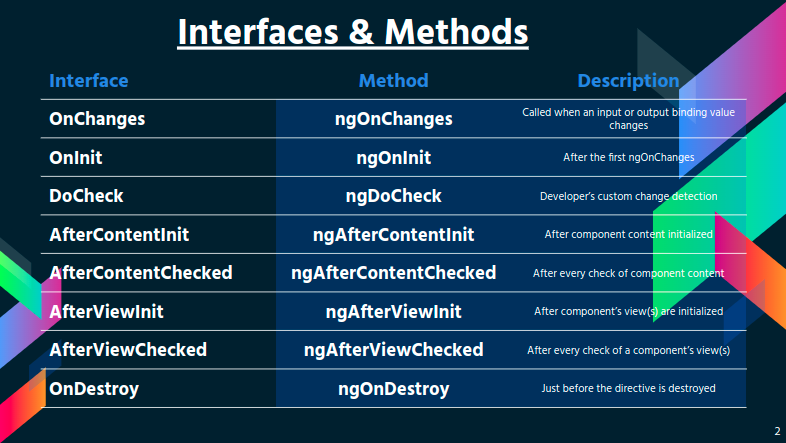

## Ciclo de vida de un componente

Un componente tiene un ciclo de vida que comienza cuando Angular crea una instancia de la clase de componente y representa la vista del componente junto con sus vistas secundarias.

El ciclo de vida continúa con la detección de cambios, ya que Angular verifica cuándo cambian las propiedades vinculadas a los datos y actualiza tanto la vista como la instancia del componente según sea necesario.

El ciclo de vida finaliza cuando Angular destruye la instancia del componente y elimina su plantilla renderizada del DOM.

Las directivas tienen un ciclo de vida similar, ya que Angular crea, actualiza y destruye instancias en el curso de la ejecución.

### Interfaces que se ejecutan durante el ciclo de vida de un componente



### Las tres interfaces mas importantes

```typescript
  ngOnChanges(changes: SimpleChanges): void {
    console.log('Change->', changes);
    // Trae los cambios anteriores y los nuevos
    // Se los ve con los inputs, outputs
  }
  ngOnInit(): void {
    console.log('OnInit->');
    // Se ejecuta si no hay inputs u outputs
    // Se lo usa para consumir API
  }
  ngOnDestroy(): void {
    console.log('Destroy');
    // Se utiliza para la desuscripcion de los observables y cuando el usuario va a abondar el componente
  }
```
