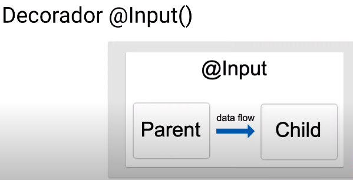
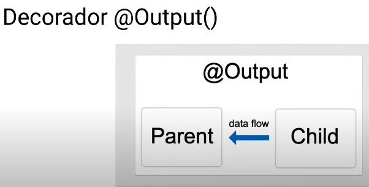

## ¿Qué es un decorador?

Un decorador es un tipo especial de declaración que se puede adjuntar a una clase, método, descriptor de acc.

### Decorador @Input()

El decorador @Input() en un componente (o directiva) hijo significa que la propiedad puede recibir su valor



Como ejemplo se crea un componente llamado **button**

```console
ng g c button
```

```html
<!--app.component.html-->
<ul>
  <li
    *ngFor="let city of cities"
    (click)="onCityClicked(city)"
    [ngClass]="{'selected':city===selection}"
  >
    {{city}}
  </li>
</ul>

<div *ngIf="selection">
  <p>Your city is: {{selection}}</p>
  <!-- <button (click)="onClear()">Clear your selection</button> -->
  <!-- Se inyecta el componente creado -->
  <app-button
    (click)="onClear()"
    [color]="'red'"
    [label]="'Clear your selection'"
  ></app-button>
</div>
```

```typescript
//button.component.ts
@Component({
  selector: "app-button",
  template: `<button [ngStyle]="{ 'background-color': color }">
    {{ label }}
  </button>`,
  styleUrls: ["./button.component.css"],
})
export class ButtonComponent implements Onchanges, OnInit, OnDestroy {
  @Input() color!: string;
  @Input() label!: string;
  constructor() {}
  ngOnChanges(changes: SimpleChanges): void {
    console.log("Changes->", changes);
  }
  ngOnInit(): void {
    console.log("OnInit");
  }
  ngOnDestroy(): void {
    console.log("OnDestroy");
  }

  //Para ver el ciclo de vida, abrir la consola del inspector de elementos
}
```

### Decorador @Output()

El decorador @Output () en un componente (o directiva) hijo permite que los datos fluyan del hijo al padre.



Como ejemplo se crea un componente llamado **form-new-item**

```console
ng g c form-new-item
```

```typescript
//app.component.ts
name!: string;
selection!: string;
cities = ["Barcelona", "Madrid", "Lima"];

addNewCity(city:string):void {
  this.cities.push(city);
}

onCityClicked(city: string):void{
  console.log("City ->", city);
  this.selection = city;
}
onClear():void{
  this.selection = "";
}
```

```html
<!--app.component.html-->

<app-form-new-item
  (newItemEvent)="addNewCity($event)"
  [label]="'City'"
  [className]="'btn-info'"
></app-form-new-item>

<ul>
  <li
    *ngFor="let city of cities"
    (click)="onCityClicked(city)"
    [ngClass]="{'selected':city===selection}"
  >
    {{city}}
  </li>
</ul>

<div *ngIf="selection">
  <p>Your city is: {{selection}}</p>
  <!-- <button (click)="onClear()">Clear your selection</button> -->
  <app-button
    (click)="onClear()"
    [color]="'red'"
    [label]="'Clear your selection'"
  ></app-button>
</div>
```

```html
<!--form-new-item.component.html-->
<form>
  <label for="newItem">New {{label}}</label>
  <!-- template variable -->
  <input type="text" id="newItem" #newItem />
  <button
    (click)="onAddNewItem(newItem.value)"
    type="button"
    [ngClass]="[className]"
  >
    Add {{label}}
  </button>
</form>
```

```typescript
// form-new-item.component.ts
import { Component, Input, OnInit, Output, EventEmitter } from "@angular/core";

@Component({
  selector: "app-form-new-item",
  templateUrl: "./form-new-item.component.html",
  styleUrls: ["./form-new-item.component.css"],
})
export class FormNewItemComponent {
  @Input() className!: string;
  @Input() label!: string;

  @Output() newItemEvent = new EventEmitter<string>();

  onAddNewItem(item: string): void {
    console.log("Item", item);
    this.newItemEvent.emit(item);
  }
}
```

Cabe destacar que cuando usamos el decorador @Input se utiliza [ ] para indicarle al componente hijo el valor que se esta pasando, en cambio el decorador @Output utiliza ( ) para capturar el valor emitido y pasrselo al metodo que tiene el componente padre.
