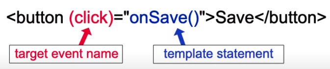

## Event binding

### ¿Qué es?

Para vincular a un evento, utiliza la sintaxis de vinculación de eventos Angular.

Esta sintaxis consta de un nombre de evento de destino entre paréntesis a la izquierda de un signo igual y una declaración de plantilla entre comillas a la derecha.
En el siguiente ejemplo, el nombre del evento de destino es click y la instrucción de la plantilla es onSave().



Nos permite escuchar y responder a acciones del usuario, como por ejemplo: pulsasiones de teclas, movimientos del mouse, clicks.

```css
.selected {
  background-color: rebeccapurple;
  color: white;
  padding: 1rem;
}

.unSelected {
  background-color: white;
  color: black;
}

.red {
  color: red;
}
```

```html
<!--app.component.html-->
<ul>
  <li
    *ngFor="let city of cities"
    (click)="onCityClicked(city)"
    [ngClass]="{'selected':city===selection}"
  >
    {{city}}
  </li>
</ul>

<div *ngIf="selection">
  <p>Your city is: {{selection}}</p>
  <button (click)="onClear()">Clear your selection</button>
</div>
```

```typescript
//app.component.ts
name!: string;
selection!: string;
cities = ["Barcelona", "Madrid", "Lima"];

onCityClicked(city: string):void{
  console.log("City ->", city);
  this.selection = city;
}
onClear():void{
  this.selection = "";
}
```

### Event Binding

```html
<!--Archivo app.component.html-->
<h1>Eventos</h1>
<button [disabled]="btnDisabled">Enviar</button>
<button (click)="toggleButton()">Toggle Button</button>
<br />
<button (click)="increaseNumber()">Number ++</button>
<p>Number: {{thing.number}}</p>
```

```typescript
//Archivo app.component.ts
import { Component } from "@angular/core";

@Component({
  selector: "app-root",
  templateUrl: "./app.component.html",
  styleUrls: ["./app.component.scss"],
})
export class AppComponent {
  img = "https://placeimg.com/200/200/any";
  name = "Gabriel";
  number = 12;
  btnDisabled = true;
  thing = {
    name: "Gabriel",
    number: 21,
    img: "https://placeimg.com/200/200/any",
  };
  //Puede ser public o private, pero si se lo quiere usar en el componente debe ser public (por defecto)
  toggleButton() {
    this.btnDisabled = !this.btnDisabled;
  }
  increaseNumber() {
    this.thing.number += 1;
  }
}
```

### Otros eventos que escuchar

- Keyup, Scroll

```html
<!--Archivo app.component.html-->
<div class="box" (scroll)="onScroll($event)">
  <p>
    Lorem ipsum, dolor sit amet consectetur adipisicing elit. Voluptatibus
    quidem incidunt adipisci quod saepe non. Ratione tempore incidunt et, quo
    eaque illo accusantium neque eveniet necessitatibus qui, consectetur
    eligendi vel. Lorem ipsum dolor sit amet consectetur adipisicing elit.
    Temporibus earum distinctio laboriosam unde porro dicta iure nam deleniti
    animi, officia, ad at odit repellendus provident error numquam eaque
    tempore! Maxime!
  </p>
</div>
<p>Nombre {{thing.name}}</p>
<input type="text" [value]="thing.name" (keyup)="changeName($event)" />
```

```css
//Archivo app.component.scss
.box {
  height: 200px;
  width: 200px;
  overflow: auto;
  background-color: rebeccapurple;
  color: white;
}
```

```typescript
//Archivo app.component.ts

import { Component } from "@angular/core";

@Component({
  selector: "app-root",
  templateUrl: "./app.component.html",
  styleUrls: ["./app.component.scss"],
})
export class AppComponent {
  img = "https://placeimg.com/200/200/any";
  name = "Gabriel";
  number = 12;
  btnDisabled = true;
  thing = {
    name: "Gabriel",
    number: 21,
    img: "https://placeimg.com/200/200/any",
  };

  // Otros eventos
  onScroll(event: Event) {
    const element = event.target as HTMLElement;
    console.log(element.scrollTop);
  }
  changeName(event: Event) {
    const element = event.target as HTMLInputElement;
    console.log(element.value);
    this.thing.name = element.value;
  }
}
```
