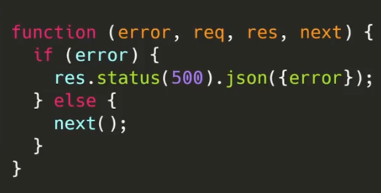

## Configuración

### Preparación de entorno de trabajo

```console
npm init -y
git init
touch .editorconfig .eslintrc.json index.js
```

### Extraer configuración inicial de gitignore

- Ir a la página: [toptal](https://www.toptal.com/developers/gitignore)
- Seleccionamos: Node, Windows, Linux, macOS
- Copiamos el código y lo pegamos al **.gitignore**
- Copiar en el archivo **.editorconfig** la siguiente configuración

```console
# Editor configuration, see https://editorconfig.org
root = true

[*]
charset = utf-8
indent_style = space
indent_size = 2
insert_final_newline = true
trim_trailing_whitespace = true

[*.js]
quote_type = single

[*.md]
max_line_length = off
trim_trailing_whitespace = false
```

- Copiar en el archivo **.eslintrc** la siguiente configuración

```json
{
  "parserOptions": {
    "ecmaVersion": 2018
  },
  "extends": ["eslint:recommended", "prettier"],
  "env": {
    "es6": true,
    "node": true,
    "jest": true
  },
  "rules": {
    "no-console": "warn"
  }
}
```

### Scripts del archivo package.json

```json
"scripts": {
    "dev": "nodemon index.js",
    "start": "node index.js",
    "lint": "eslint"
  },
```

### Instalación de dependecias de desarrollo

```console
npm i nodemon eslint eslint-config-prettier eslint-plugin-prettier prettier -D
```

### Instalación de Express y creación del servidor HTTP

```console
npm i express
```

```javascript
//Archivo index.js
const express = require("express");
const app = express();
const port = 3000;

app.get("/", (req, res) => {
  res.send("Hi, my server in express");
});

app.listen(port, () => {
  console.log("Server on port: " + port);
});
```

Ejecutar en la consola:

```console
npm run dev
```

### ¿Qué es una RESTful API?

- **REST** significa: Representational State Transfer

Ejemplos de uso los verbos de la arquitectura REST


### GET: recibir parámetros

```javascript
app.get("/products", (req, res) => {
  const { id } = req.params;
  res.json([
    {
      id,
      name: "Product 1",
      price: 2000,
    },
    {
      id,
      name: "Product 2",
      price: 3000,
    },
  ]);
});

//Recibir un id
app.get("/products/:id", (req, res) => {
  const { id } = req.params;
  res.json({
    id,
    name: "Product 1",
    price: 2000,
  });
});

//Recibir 2 id
app.get("/categories/:categoryId/products/:productId", (req, res) => {
  const { categoryId, productId } = req.params;
  res.json({
    categoryId,
    productId,
    name: "Product 1",
    price: 2000,
  });
});
```

### GET: parámetros query

- Mayormente se los usa para hacer filtros
- Ejemplos:
  

```javascript
app.get("/users", (req, res) => {
  const { limit, offset } = req.query;
  if (limit && offset) {
    res.json({
      limit,
      offset,
    });
  } else {
    res.send("no hay parámetros");
  }
});
```

- Libreria para generar datafake: [faker-js](https://fakerjs.dev/guide/#overview)
- Instalación:

```console
npm install @faker-js/faker --save-dev
```

- Consumiendo desde el endpoint se le puede pasar parametros tales como size: https://localhost:3000/products?size=10

```javascript
app.get("/products", (req, res) => {
  const products = [];
  const { size, offset } = req.query;
  const limit = size || 10; // Solo genera 10 si no se especifica por el endpoint
  for (let index = 0; index < 100; index++) {
    products.push({
      name: faker.commerc.productName(),
      price: parseInt(faker.commerc.price(), 10),
      image: faker.image.imageUrl(),
    });
  }
  res.json(products);
});
```

### Separación de responsabilidades con express.Router

- Se crea una carpeta **routes** en donde van a estar las rutas.

```console
mkdir routes
```

Ejemplo:

```console
touch routes/products.router.js
```

```javascript
//Archivo products.router.js
const express = require("express");
const router = express.Router();

router.get("/", (req, res) => {
  res.send("get");
});

module.exports = router;
```

```console
touch routes/index.js
```

```javascript
//Archivo routes/index.js
const express = require("express");

const productsRouter = require("./products.router");

function routerApi(app) {
  const router = express.Router(); //Para crear ruta maestra
  app.use("/api/v1", router); //Endpoint por el que siempre empiezan las rutas
  router.use("/products", productsRouter);
  //Para acceder al endpoint sería: http://localhost:3000/api/v1/products
}

module.exports = routerApi;
```

```javascript
//Archivo index.js
const express = require("express");
const routerApi = require("./routes");

const app = express();
const port = process.env.PORT || 3000;

routerApi(app);

app.listen(port, () => {
  console.log("Server on port: " + port);
});
```

### POST: Método para crear

- Para usar el método POST se necesita un cliente tipo REST
- En VSCode existe una extensión llamada **Rest Client** que permite hacerlo, la petición sería la siguiente:

```json
POST http://localhost:3000/api/v1/products
content-type: application/json

{
   "name": "New product",
   "price": 1231,
   "img": "http://placeimg.com/640/300"
}
```

#### Creando el método POST en el router de productos

```javascript
router.post("/", (req, res) => {
  const body = req.body;
  res.json({
    message: "created",
    data: body,
  });
});
```

- Al enviar la petición con el cliente no se puede ver el **body**
- Para solucionarlo se debe usar un middleware nativo de express

```javascript
// Archivo index.js
app.use(express.json());
```

- Volvemos en enviar la petición con el cliente y se debería mostrar el **body**

### PUT, PATCH y DELETE

- **PATCH** solo se le envia lo que se quiere modificar, no es necesario enviar todo el cuerpo.

```javascript
router.patch("/:id", (req, res) => {
  const body = req.body;
  const { id } = req.params;
  res.json({
    message: "updated",
    data: body,
    id,
  });
});
```

- **DELETE**

```javascript
router.delete("/:id", (req, res) => {
  const { id } = req.params;
  res.json({
    message: "deleted",
    id,
  });
});
```

### Códigos de estado o HTTP response status codes

- Páginas para ver los códigos de estado: [http.cat](https://http.cat/), [mdn](https://developer.mozilla.org/es/docs/Web/HTTP/Status)

- Cuando se crea algo debería retornar un código 201. Entonces:

```javascript
router.post("/", (req, res) => {
  const body = req.body;
  res.status(201).json({
    message: "created",
    data: body,
  });
});
```

- Ejemplo de código 404

```javascript
app.get("/:id", (req, res) => {
  //Importante: todo lo que se pasa por parámetro lo devuelve como string
  const { id } = req.params;
  if (id === "999") {
    res.status(404).json({
      mssage: "not found",
    });
  } else {
    res.status(200).json({
      id,
      name: "Product 1",
      price: 2000,
    });
  }
});
```

### Introducción a servicios

- En el siguiente archivo se define toda la lógica y las interacciones a nivel transaccional de los datos (products en este caso).
- Se debe encargar de como se crea, edita, actualiza todo frente a la entidad (producto)

```console
mkdir services
touch services/product.service.js
```

```javascript
// Archivo services/product.service.js
class ProductsService {
  constructor() {
    this.products = [];
    this.generate();
  }

  generate() {
    const limit = 100;
    for (let index = 0; index < limit; index++) {
      this.products.push({
        id: faker.datatype.uuid(),
        name: faker.commerce.productName(),
        price: parseInt(faker.commerce.price(), 10),
        image: faker.image.imageUrl(),
        isBlock: faker.datatype.boolean(),
      });
    }
  }

  find() {
    return this.products;
  }

  findOne(id) {
    return this.products.find((item) => item.id === id);
  }
}

module.exports = ProductsService;
```

```javascript
// Archivo products.router.js
const ProductsService = require("./../services/product.service");
const service = new ProductsService();

router.get("/", (req, res) => {
  const products = service.find();
  res.json(products);
});

router.get("/:id", (req, res) => {
  const { id } = req.params;
  const product = service.findOne(id);
  res.json(product);
});
```

- Cliente REST

```console
GET http://localhost:3000/api/v1/products
```

```console
GET http://localhost:3000/api/v1/products/asdsadad
```

### Crear, editar, eliminar

```javascript
// Archivo services/product.service.js
class ProductsService {
  constructor() {
    this.products = [];
    this.generate();
  }

  generate() {
    const limit = 100;
    for (let index = 0; index < limit; index++) {
      this.products.push({
        id: faker.datatype.uuid(),
        name: faker.commerce.productName(),
        price: parseInt(faker.commerce.price(), 10),
        image: faker.image.imageUrl(),
        isBlock: faker.datatype.boolean(),
      });
    }
  }

  create(data) {
    const newProduct = {
      id: faker.datatype.uuid(),
      ...data,
    };
    this.products.push(newProduct);
    return newProduct;
  }

  find() {
    return this.products;
  }

  findOne(id) {
    return this.products.find((item) => item.id === id);
  }
  update(id, changes) {
    const index = this.products.findIndex((item) => item.id === id);
    if (index === -1) {
      throw new Error("product not found");
    }
    const product = this.products[index];
    this.products[index] = {
      ...product,
      ...changes,
    };
    return this.products[index];
  }

  delete(id) {
    const index = this.products.findIndex((item) => item.id === id);
    if (index === -1) {
      throw new Error("product not found");
    }
    this.products.splice(index, 1);
    return { id: "deleted" };
  }
}

module.exports = ProductsService;
```

```javascript
// Archivo products.router.js
const ProductsService = require("./../services/product.service");
const service = new ProductsService();

router.post("/", (req, res) => {
  const body = req.body;
  const newProduct = service.create(body);
  res.status(201).json(newProduct);
});

router.patch("/:id", (req, res) => {
  const { id } = req.params;
  const body = req.body;
  const product = service.update(id, body);
  res.json(product);
});

router.delete("/:id", (req, res) => {
  const { id } = req.params;
  const rta = service.delete(id);
  res.json(rta);
});
```

### Async await y captura de errores

```javascript
// Archivo services/product.service.js
class ProductsService {
  constructor() {
    this.products = [];
    this.generate();
  }

  generate() {
    const limit = 100;
    for (let index = 0; index < limit; index++) {
      this.products.push({
        id: faker.datatype.uuid(),
        name: faker.commerce.productName(),
        price: parseInt(faker.commerce.price(), 10),
        image: faker.image.imageUrl(),
        isBlock: faker.datatype.boolean(),
      });
    }
  }

  async create(data) {
    const newProduct = {
      id: faker.datatype.uuid(),
      ...data,
    };
    this.products.push(newProduct);
    return newProduct;
  }

  //Simulación de una petición asincrona con una promesa
  find() {
    return new Promise((resolve, reject) => {
      setTimeout(() => {
        resolve(this.products);
      }, 3000);
    });
  }

  async findOne(id) {
    return this.products.find((item) => item.id === id);
  }
  async update(id, changes) {
    const index = this.products.findIndex((item) => item.id === id);
    if (index === -1) {
      throw new Error("product not found");
    }
    const product = this.products[index];
    this.products[index] = {
      ...product,
      ...changes,
    };
    return this.products[index];
  }

  async delete(id) {
    const index = this.products.findIndex((item) => item.id === id);
    if (index === -1) {
      throw new Error("product not found");
    }
    this.products.splice(index, 1);
    return { id: "deleted" };
  }
}

module.exports = ProductsService;
```

```javascript
// Archivo products.router.js
const ProductsService = require("./../services/product.service");
const service = new ProductsService();

router.get("/", async (req, res) => {
  const products = await service.find();
  res.json(products);
});

router.get("/:id", async (req, res) => {
  const { id } = req.params;
  const product = await service.findOne(id);
  res.json(product);
});

router.post("/", async (req, res) => {
  const body = req.body;
  const newProduct = await service.create(body);
  res.status(201).json(newProduct);
});
//Captura de error con try catch
router.patch("/:id", async (req, res) => {
  try {
    const { id } = req.params;
    const body = req.body;
    const product = await service.update(id, body);
    res.json(product);
  } catch (error) {
    res.status(404).json({
      message: error.message,
    });
  }
});

router.delete("/:id", async (req, res) => {
  const { id } = req.params;
  const rta = await service.delete(id);
  res.json(rta);
});
```

### ¿Qué son los middlewares?


- Están en medio del request y el response
- Cada vez que se usa la función **.use()** se está ejecutando un middleware.
- Puede funcionar de forma secuencial, uno detrás de otros.


#### Estructura de un middleware


- La función **next** nos permite avanzar hacia el siguiente middleware.
- La función **res.send("end")** finaliza la respuesta.

#### Middleware de error

- Recibe como parámetro el error



#### Casos de usos:

- Funcionan como pipes
- Validar datos
- Capturar errores
- Validad permisos
- Controlar accesos

### Middleware para errores

- Uso de middleware global

```console
mkdir middlewares
touch middlewares/error.handler.js
```

```javascript
// Archivo middlewares/error.handler.js
//Encargado de capturar cualquier errror
function logErrors(err, req, res, next) {
  console.log("LogErrors");
  console.error(err);
  next(err); //Middlewre de tipo error, si estuviera vacio sería uno normal
}

//Detecta un error, pero le da formato para devolverle al cliente
function errorHandler(err, req, res, next) {
  console.log("ErrorHandler");
  res.status(500).json({
    message: err.message,
    stack: err.stack, // Para saber en donde ocurrió el error
  });
  //Aunque no se use next, se lo debe colocar para que detecte que es un middleware de tipo error
  //No avanza al sgte middleware
}

module.exports = { logErrors, errorHandler };
```

```javascript
//Archivo index.js
const express = require("express");
const routerApi = require("./routes");
const { errorHandler, logErrors } = require("./middlewares/error.handler");

const app = express();
const port = process.env.PORT || 3000;

routerApi(app);

//Se lo debe usar despues de definir el routing
app.use(logErrors);
app.use(errorHandler);

app.listen(port, () => {
  console.log("Server on port: " + port);
});
```

```javascript
// Archivo products.router.js

router.get("/:id", async (req, res, next) => {
  try {
    const { id } = req.params;
    const product = await service.findOne(id);
    res.json(product);
  } catch (error) {
    next(error);
  }
});
```

### Manejo de errores con Boom

- Instalación

```console
npm i @hapi/boom
```

```javascript
// Archivo services/product.service.js
const boom = require("@hapi/boom");
class ProductsService {
  constructor() {
    this.products = [];
    this.generate();
  }

  generate() {
    const limit = 100;
    for (let index = 0; index < limit; index++) {
      this.products.push({
        id: faker.datatype.uuid(),
        name: faker.commerce.productName(),
        price: parseInt(faker.commerce.price(), 10),
        image: faker.image.imageUrl(),
        isBlock: faker.datatype.boolean(),
      });
    }
  }

  create(data) {
    const newProduct = {
      id: faker.datatype.uuid(),
      ...data,
    };
    this.products.push(newProduct);
    return newProduct;
  }

  find() {
    return this.products;
  }

  findOne(id) {
    const product = this.products.find((item) => item.id === id);
    if (!product) {
      //Con libreria boom
      throw boom.notFound("Product not found");
    }
    return product;
  }
  update(id, changes) {
    const index = this.products.findIndex((item) => item.id === id);
    if (index === -1) {
      // throw new Error("product not found"); - Antes
      //Con libreria boom
      throw boom.notFound("Product not found");
    }
    const product = this.products[index];
    this.products[index] = {
      ...product,
      ...changes,
    };
    return this.products[index];
  }

  delete(id) {
    const index = this.products.findIndex((item) => item.id === id);
    if (index === -1) {
      // throw new Error("product not found"); - Antes
      //Con libreria boom
      throw boom.notFound("Product not found");
    }
    this.products.splice(index, 1);
    return { id: "deleted" };
  }
}

module.exports = ProductsService;
```

```javascript
// Archivo middlewares/error.handler.js

function boomErrorHandler(err, req, res, next) {
  if (err.isBoom) {
    const { output } = err;
    res.status(output.statusCode).json(output.payload);
  }
  next(err);
}
module.exports = { boomErrorHandler };
```

```javascript
//Archivo index.js
const express = require("express");
const routerApi = require("./routes");
const {
  errorHandler,
  logErrors,
  boomErrorHandler,
} = require("./middlewares/error.handler");

const app = express();
const port = process.env.PORT || 3000;

routerApi(app);

//Se lo debe usar despues de definir el routing
app.use(logErrors);
app.use(boomErrorHandler);
app.use(errorHandler);

app.listen(port, () => {
  console.log("Server on port: " + port);
});
```

```javascript
// Archivo products.router.js

router.get("/:id", async (req, res, next) => {
  try {
    const { id } = req.params;
    const product = await service.findOne(id);
    res.json(product);
  } catch (error) {
    next(error);
  }
});
```
