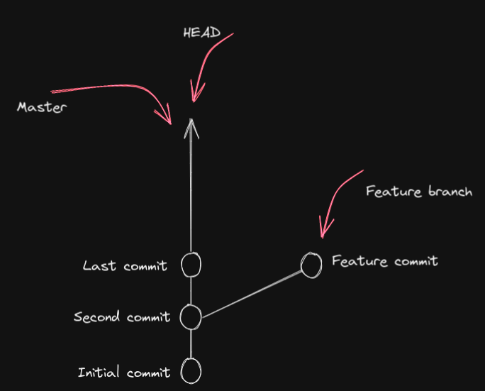
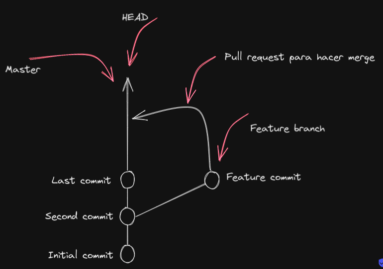
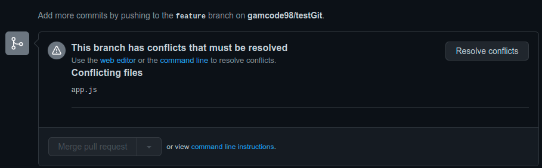
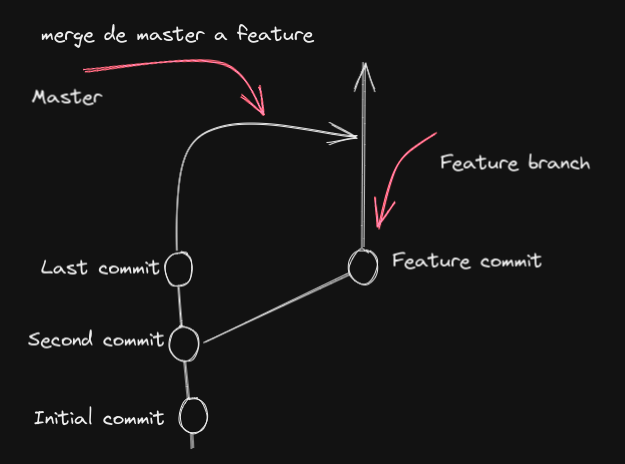
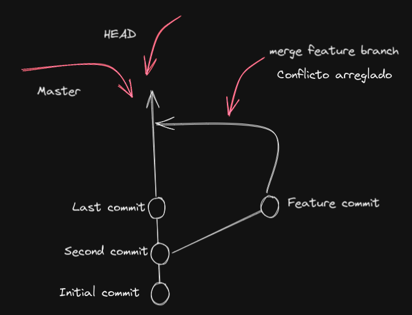
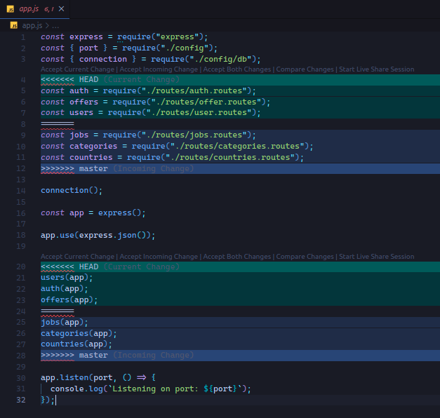
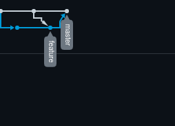

## Arreglar un pull request con conflictos

### Estado inicial 



Supongamos que en la rama **feature** se está modificando un archivo tal como **app.js** que contenía el siguiente código de **master**

```javascript
//app.js código inicial

const express = require("express");
const { port } = require("./config");
const { connection } = require("./config/db");


connection();

const app = express();

app.use(express.json());


app.listen(port, () => {
  console.log(`Listening on port: ${port}`);
});
```

Se procede a modifcar el archivo quedando al final tal como: 

```javascript
//app.js código modificado desde rama feature

const express = require("express");
const { port } = require("./config");
const { connection } = require("./config/db");
const auth = require("./routes/auth.routes"); //agregado desde rama feature
const offers = require("./routes/offer.routes"); //agregado desde rama feature
const users = require("./routes/user.routes"); //agregado desde rama feature

connection();

const app = express();

app.use(express.json());

users(app); //agregado desde rama feature
auth(app); //agregado desde rama feature
offers(app); //agregado desde rama feature

app.listen(port, () => {
  console.log(`Listening on port: ${port}`);
});
```

Paralelamente se está modificando el archivo **app.js** directamente desde **master** en las mismas líneas pero diferente código

```javascript
//app.js código modificado desde rama master

const express = require("express");
const { port } = require("./config");
const { connection } = require("./config/db");
const jobs = require("./routes/jobs.routes"); //agregado desde rama master
const categories = require("./routes/categories.routes"); //agregado desde rama master
const countries = require("./routes/countries.routes"); //agregado desde rama master

connection();

const app = express();

app.use(express.json());

jobs(app); //agregado desde rama master
categories(app); //agregado desde rama master
countries(app); //agregado desde rama master

app.listen(port, () => {
  console.log(`Listening on port: ${port}`);
});
```

Ahora se quiere unificar las ramas, por lo tanto se procede a hacer el **pull request** de la rama **feature** a **master**



En github nos muestra el siguiente mensaje



Github da la posibilidad de arreglar el conflicto desde su web. Pero se lo puede trabajar localmente. 

Primero desde la pc local desde la rama **master** se ejecuta `git pull origin master` para traer los cambios que no tenia el repo local.

Luego hay que situarse en la rama conflictiva en este caso es **feature** y ejecutar `git merge master`

Graficamente sería:



Luego de arreglado el conflicto 




Inmediatamente después de ejecutar el comando `git merge master` en la rama **feature**, **Visual Studio Code** nos ayuda con posibles soluciones. Las cuales aparecen abajo de la línea 3 y línea 19 en este caso.



Se corrige el código. Se procede a realizar el correspondiente commit con su push a su respectiva rama y por último se procede a realizar el merge.

Grafica que brinda github, en la sección de **insights**




