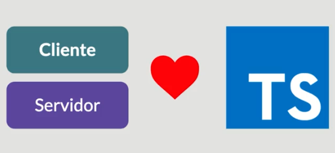
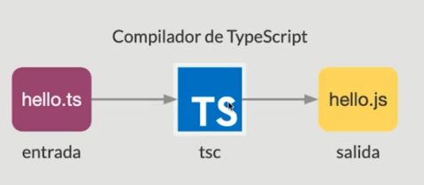
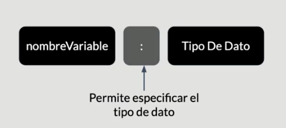
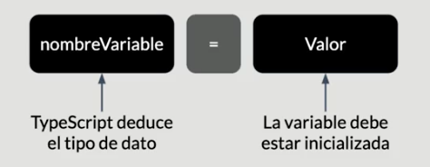
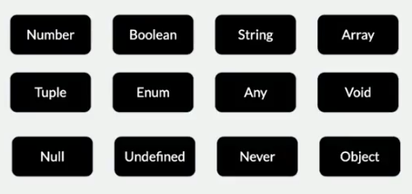

## Fundamentos

### ¿Que es TypeScript?

- Lenguaje de programación tipado
- Lenguaje de alto nivel
- Genera como resultado código JavaScript
- Código abierto
- Desarrollo en cualquier sistema operativo
- El código puede ejecutarse en cualquier navegador o plataforma

### Si conoces JavaScript conoces TypeScript


### ¿Por qué usar TypeScript?

- Programación orientada a objetos
- Potencia el código JavaScript
- Mayor productividad
- Poderoso sistema de tipos
- Compila a ES5, ES6 y más
- Proyecto muy activo/_Open Source_
- Actualizaciones periódicas
- Comunidad creciente

### Se puede usar tanto como en el frontend como en el backend



### Instalación del compilador de TypeScript

```console
npm install -g typescript
```

Para verificar que está correctamente instala se usa el comando

```console
tsc --version
```

### Usando el compilador de TypeScript



De manera práctica se puede ejecutar

```console
tsc hello.ts
ls
hello.js    hello.ts
```

Ahora se necesita un runtime de JavaScript que es quien va a ejecutar el código JavaScript resultante

```console
node hello.js
```

El compilador de TypeScript tiene una opción que permite registrar los cambios.

```console
tsc --watch hello.ts
```

### El archivo de configuración de TypeScript

¿Qué es el archivo de configuración **tsconfig.js**?

- Especifica la raíz de un proyecto TypeScript
- Permite configurar opciones para el compilador

### Generación del archivo tsconfig.json

Se ejecuta el siguiente comando:

```console
tsc --init
```

El archivo consta de un objeto **json**

```json
{
  "extends": "./configs/base", //-> Se usa para heredar las configuraciones de un archivo json general
  "compileOnSave": true, //->Seusa para que cada vez que se guarde un archivo se compile el código automaticamente
  "compilerOptions": {
    "target": "es2016", //-> Especifica la versión de ES
    "module": "commonjs", //-> Especifica la configuración para generación de modulos
    "esModuleInterop": true,

    "forceConsistentCasingInFileNames": true,

    "strict": true, //-> Hablita la verificación estricta de tipos

    "skipLibCheck": true,
    "removeComments": true //-> Permite eliminar los comentarios al codigo fuente
  },
  "include": ["src/**/*.ts"], //-> Indica que archivos van a ser procesados por ek compilador
  "exclude": ["node_modules", "**/*.test.ts"] //->Excluye archicos o directorios del preceso de compilación
}
```

### Usando el archivo tsconfig.json

```console
tsc ------------------> Busca la configuración
tsc --project gamcode --------> Especifica un directorio que contiene la configuración
tsc files.ts ------------------> Omite la configuración
```

### Tipado en TypeScript

- Explícito
  - Define una sintaxis para la creación de variables con tipo de dato.
- Inferido
  - TypeScript tiene la habilidad de "deducir" el tipo en función de un valor

Tipado en TypeScript **Explícito**



Tipado en TypeScript **Implícito**



### Tipos básicos

Tipos de datos simples en TypeScript

#### Tipos primitivos



#### Number

```typescript
//declaración explícita
let phone: number;
phone = 5;
phone = "hola"; //-> Error

//declaración inferida
let phoneNumber = 2; //-> Al hacer hover sobre la variable se puede ver que typeScript le asigna un tipo
phoneNumber = 232;
phoneNumber = true; //-> Error
```

#### Boolean

```typescript
let isPro: boolean;
isPro = false;
```

#### String

```typescript
let username: string = "gamcode";
//Con template string
let userInfo: string = `${username} este es mi username`;
```

### Any, Void y Never

#### Tipo: Any

- Usado para capturar valores dinámicos
- Los valores pueden cambiar de tipo en el tiempo:
  - APIs externas
  - Librerías de terceros

> Se lo usa como último recurso, no es buena práctica.

```typescript
let idUser: any = 1;
idUser = "1"; // -> No da error
console.log("idUser", idUser);
```

#### Tipo: Void

- **void** es lo opuesto de **any**: representa la ausencia de tipo
- Comúnmente se usa como tipo de retorno en funciones (en la declaración de las mismas)
- Tambien se las utiliza cuando las funciones no retornan ningún valor

```typescript
//Any
function showInfo(user: any): any {
  console.log("User info", user.id, user.username, user.firstName);
  //return "hola"; -> Si tuviera el return estaría devolviendo ese estring
}
showInfo({ id: 1, username: "gamcode", firstName: "gabriel" });
```

#### Tipo void, como tipo de dato en variable

```typescript
let unusable: void;
unusable = null;
unusable = undefined;

//Hay que deshabilitar el modo strict de tsconfig.json
```

#### Tipo: Never

- Representa el tipo de valor que nunca ocurre
  - Funciones que lanzan exepciones
  - Funciones que nunca retornan un valor
  - Funciones con ciclos infinitos, que no permiten que se finalice

```typescript
//Never
function handleError(code: number, message: string): never {
  //Proceso de codigo aqui
  //Se genera un mensaje
  throw new Error(`${message}. Code: ${code}`);
}
try {
  handleError(404, "Not Found");
} catch (error) {}
```

### Null y Undefined

- En TypeScript, ambos "valores" tienen sus respectivos:
  - **null**
  - **undefined**

```typescript
let nullVariable: null;
nullVariable = null;
nullVariable = 1; // Error
```

```typescript
let undefinedVariable: undefined;
undefinedVariable = undefined;
undefinedVariable = 1; // Error
```

#### Null y Undefined como subtipos

- Null y Undefined se pueden asumir como subtipos de los otros tipos de datos, por ejemplo **any**
- Significa que se puede asignar **null** y **undefined** a una variable de tipo **string**, por ejemplo

```typescript
let albumName: string;
albumName = null;
albumName = undefined;
//Error hay que descomentar la linea en la aparece la opción "strictNullChecks en el archivo tsconfig.json para que lo permita
```

#### Null y Undefined: La opción --strictNullChecks

- Solo permite asignar **null** y **undefined** a una variable de tipo **any** o sus tipos respectivos.
- Ayuda a evitar errores comunes en programción de apps en el ámbito JavaScript.

Otra opción es usar la bandera **--strictNullChecks** en la terminal:

```console
tsc --watch src/main.ts --strictNullChecks
```

### Object

#### Tipo: object

- **object** es el tipo de dato que representa un valor no primitivo.
- Es el tipo de variable que no sea number, string, boolean, null, undefined, etc.

```typescript
let user: object = {};
user = {
  id: 1,
  username: gamcode,
};
console.log("user.username", user.username); //Error
```

#### Object vs object

- **Object**: instancia de la clase Object de JavaScript
- **object**: tipo de valores no primitivos. Con este tipo no se puede acceder a las propiedades del objeto.

```typescript
//Object vs object (Clase JS vs tipo TS)
const myObj = {
  id: 1,
  username: gamcode,
};

const isInstance = myObj instanceof Object; // retorna true o false
console.log("isInstance", isInstance);
console.log("myObj.username", myObj.username); //Ok
```

### Array

- Al igual que JavaScript, TypeScript permite definir un arreglo para contener un conjunto de valores.
- Usa dos notaciones: **[]** y **Array\<tipo>**

```typescript
//Corchetes []

let users: string[];
users = ["Gabriel", "Alejandro"];
users = [true, 1, "Alejandro"]; // Error

//Array<TIPO>
//<> -> Se conocen como genéricos
let pictureTtiles: Array<string>;
pictureTtiles = ["michi", "pachicha"];

//Accediendo a los valores en un Array
console.log("first user", users[0]);
console.log("first title", pictureTtiles[0]);

//Propiedades en Array
console.log("users.length", users.length);

//Uso de funciones en Arrays
console.log(users.push("lolo"));
console.log(users.sort());
console.log("users", users);
```

### Tuple

- Las tuplas permiten expresar un arreglo con un número fijo de elementos.
- Los tipos de datos son conocidos.

```typescript
// [1,"user"]
let user: [number, string];
user = [1, "gamcode"];

console.log("user", user);
console.log("username", user[1]);
console.log("username.length", user[1].length);
console.log("id", user[0]);

//Tuplas con varios valores
//id, username, isPro
let userInfo: [number, string, boolean];
userInfo = [2, "gamcode", true];
console.log("userInfo", userInfo);

//Arreglo de tuplas
let array: [number, string][] = [];
array.push([1, "michi"]);
array.push([2, "lolo"]);
array.push([3, "lensQueen"]);
array.push([4, "pepe"]);
array.push([5, "lore"]);
console.log("array", array);

//Uso de funciones Array
//lensQueen -> lensQueen001
array[2][1] = array[2][1].concat("001");
console.log("array", array);
console.log(array[2][1]);
```

### Enum

- Los enumerados permiten definir un conjunto de constantes con nombre.
- Tienen la ventaja de adaptarse al contexto de la aplicación.

```typescript
// Orientacion para fotografias

//En JS
// const landscape = 0;
// const portrait = 1;
// const square = 2;
// const panorama = 3;

//En TS
enum PhotoOrientation {
  Landscape = 0, //De forma explicita
  Portrait, //1 De forma implicita
  Square, //2
  Panorama, //3
}
const landscape: PhotoOrientation = PhotoOrientation.Landscape;
console.log("landscape", landscape); // -> muestra el num 0
console.log("Landscape", PhotoOrientation[landscape]);

//Personalización de enums
enum PictureOrientation {
  Landscape = 10,
  Portrait, //11
  Square, //12
  Panorama, //13
}
console.log("portrait", PictureOrientation.Portrait); // muestra el num 11

//Se considera las claves para personalizar
enum Country {
  Argentina = "arg",
  Colombia = "col",
  Mexico = "mex",
  EEUU = "usa",
  Espana = "esp",
}
const country: Country = Country.Colombia;
console.log("country", country);
```

### Unión de Tipos, Alias y Tipos Literales

#### Unión de tipos

- En TypeScript se puede definir una variable con múltiples tipos de datos: _Union Type_.
- Se usa el símbolo de pipe ("**|**") entre los tipos.

```typeScript
// 10, "10", -> Debe soportar numeros y cadenas
let idUser: number | string;
idUser = 10;
idUser = "10";

//Buscar username dado un ID

function getUserNameById(id: number | string){
  // Logica de negocio, find the user
  return "gamcode";
}

getUserNameById(20);
getUserNameById("20");
```

#### Alias de tipos

- TypeScript permite crear un alias como nuevo nombre para un tipo.
- El alias se puede aplicar también a un conjunto o combinación de tipos.
- Se usa la palabra reservada **type**

```typeScript
// 10, "10", -> Debe soportar numeros y cadenas
type IdUser = number | string;
type Username = string;
let idUser: IdUser;
idUser = 10;
idUser = "10";

//Buscar username dado un ID

function getUserNameById(id: IdUser): Username{
  // Logica de negocio, find the user
  return "gamcode";
}

getUserNameById(20);
getUserNameById("20");
```

#### Tipos literales

- Una variable con un tipo literal puede contener únicamente una cadena del conjunto.
- Se usan cadenas como "tipos", combinados con el símbolo de _pipe_ ("**|**") entre ellos.

```typescript
// Tipos literales
//Solo fotografias de 100x100, 500x500, 1000x1000
type SquareSize = "100x100" | "500x500" | "1000x1000";
let smallPicture: SquareSize = "200x200"; //Error xq no pertenece al tipo

let smallPicture: SquareSize = "100x100";
let mediumPicture: SquareSize = "500x500";
```

### Aserciones de tipo

- Cuando el programador puede conocer más que TypeScript sobre el valor de una variable.
- Es un mensaje al compilador: "Confía en mí, sé lo que hago"
- Se parece al casting de tipos en otros lenguajes de programción. Sin embargo no es lo mismo.
- Usa dos sintaxis: **\<Angle Bracket>** y (variable **as** tipo)

```typescript
// <tipo> // Angle Bracket Sintax
let username: any;
username = "gamcode";
//tenemos una cadena, TS confia en mi!
let message: string =
  (<string>username).length > 5
    ? `Welcome ${username}`
    : "Username is too short";

console.log("message", message);

let usernameWithId: any = "gamcode 1";
// Como obtener el username?
username = (<string>usernameWithId).substring(0, 10);
console.log("Username only: ", username); //-> Username only: gamcode

//Sintaxis "as"
message =
  (username as string).length > 5
    ? `Welcome ${username}`
    : "Username is too short";

let helloUser: any;
helloUser = "hello michi";
username = (helloUser as string).substring(6);
console.log("username", username); // michi
```

### Funciones en TypeScript

- Los parámetros en las funciones son tipados.
- Se pueden definir parámetros opcionales.
- El tipo de retorno puede ser un tipo básico, enum, tipo literal o una combinación de ellos

```typescript
// Crear una fotografia

type SquareSize = "100x100" | "500x500" | "1000x1000";

function createPicture(title: string, date: string, size: SquareSize) {
  //Se crea la fotografia
  console.log("create picture using", title, date, size);
}

createPicture("michi", "02-04-2022", "100x100");
createPicture("meme", "02-03-2022"); //Error, espera el ultimo parámetro
//Se soluciona con parametros opcionales -> "?"

function createPicture(title?: string, date?: string, size?: SquareSize) {
  //Se crea la fotografia
  console.log("create picture using", title, date, size);
}
createPicture("meme", "02-03-2022"); //Ok
```
